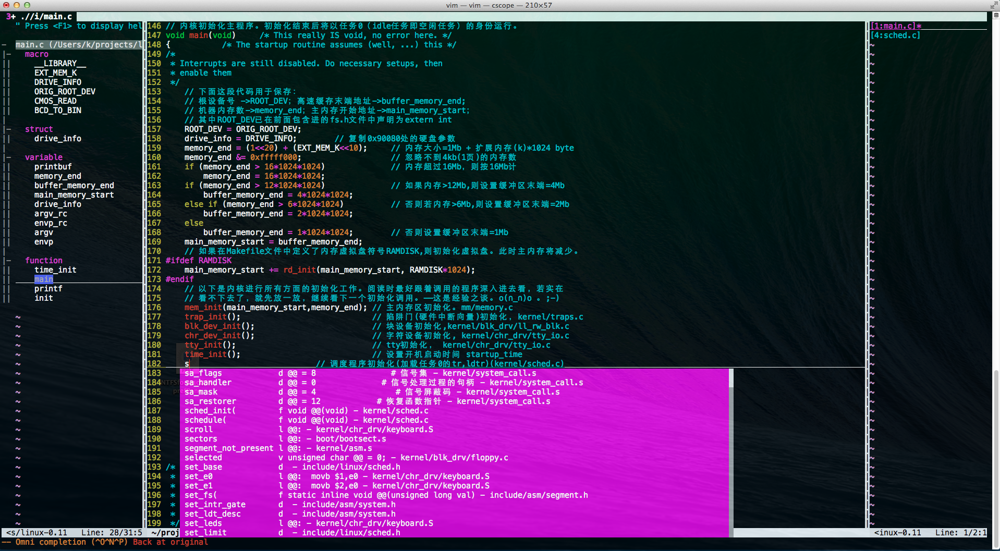

## VIM配置文件 ##
### 第一节·背景 ###
这是我的VIM的配置文件，是从网上东拼西凑搞出来的一个东西，因为用了一些年头，习惯了，所以就不想去改动一些快捷键了。

### 第二节·安装 ###
1. 可选（推荐）：先保证系统中装有ctags和cscope两个软件。（注：这两个软件需要安装GNU版本的，mac os下安装xcode的时候会同时安装上ctags，这个是不能用的，要将它替换成GNU版本的。）下面讲两种安装方法：
	* ubuntu系统：`$ sudo apt-get install ctags cscope`
	* mac os系统：`$ brew install ctags cscope`
	* (如果你喜欢玩)：可以顺便试一下在ubuntu下`$sudo apt-get install sl`或者Mac os下`$ brew install sl`. 然后在中断输入这个命令：`$ sl`.(有彩蛋.... ;-))
2. 安装配置文件：
						
		$ git clone https://github.com/karottc/vim-configure.git ~/.vim
		$ cp ~/.vim/vimrc/ ~/.vimrc	
		
	使用ctags和cscope的查找功能需要先建立索引，首先进入指定项目的目录中，然后用下面的命令：
		
		$ cscope -Rbqk
		$ ctags -R
		 
	然后就可以使用VIM了.下面先看一张整体效果图：
	
3. 效果图说明：整体可分为3个部分，左边是一个list，显示文件的函数、变量、宏等等信息；中间是主编辑区，可以代码补全、查找等操作；右边是曾经打开过的一个文件列表。

### 第三节·常用命令 ###
#### 1.VIM自带的命令 ####
* 移动：命令模式下用 h、j、k、l 这几个键。（PS：如无特殊说明，以下操作均在命令模式下进行）
* 跳转：到文件第一行 `gg`；到文件最后一行 `G`；到某一指定行(比如100行) `100gg`.
* 窗口切换：从当前窗口切换到本窗口的上下左右的邻近窗口 `ctrl+w+h/j/k/l`.
* 撤销：撤销(回退) `u`；恢复撤销 `ctrl+r`。

#### 2.配置中的命令 ####
* 显示/隐藏函数列表(上图最左侧)：按 `t`;
* 代码折叠：光标移动到缩进处，然后按 `f`;
* 查找当前文件的特定字符串：将光标移动到该字符串上，按 `#` 或 `*`, * 表示向下(正向)查找，# 表示向上(逆向)查找；
* 跳到函数定义处：将光标移动到函数名上，按`ctrl+]`;返回到调用处，按 `ctrl+t`；
* cscope几个常用查找命令：
	* `:cs find s xxx`: 整个工程中查找 xxx ,不包括注释中的；
	* `:cs find g xxx`: 整个工程中查找 xxx 的定义；
	* `:cs find c xxx`: 整个工程中查找调用 xxx 的函数；
	* `:cs find e xxx`：整个工程中查找 xxx ，包括注释中的xxx；
	* `:cs find f xxx`：整个工程中查找文件 xxx (xxx是文件名)；
	
	上面的几个都可以在.vimrc中绑定快捷键，比如目前绑定的的有 `:cs find s xxx` —— F4，即把光标放在 xxx 上，然后按 `F4`; `:cs find c xxx` —— `F8`。当用上面的命令查找出有多个的时候，按 `F6` 来移动到下一个匹配处，按 `F7` 移动到上一个匹配处。
* 帮助文档：顺便提一下现在帮助文档变成了中文的了，即输入 `:h` 会发现帮助文档是中文。;-)

### 第四节·卸载 ###

	$ rm -rf ~/.vim ~/.vimrc
	
##### 附注 #####

学习VIM的时候参考的第一篇blog：[手把手教你把Vim改装成一个IDE编程环境(图文)][blog1]。 

如果也喜欢emacs，或许也可以看看 [将Emacs配置成一个C/C++的IDE编程环境][blog2]。

[blog1]: http://blog.csdn.net/wooin/article/details/1858917
[blog2]: http://blog.csdn.net/karotte/article/details/6990031